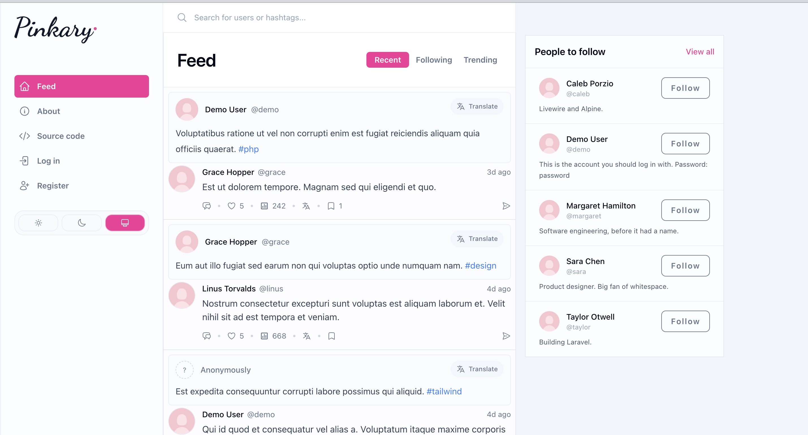

# TSG Test App

This repository is a take-home exercise. It is a fork of an existing open-source Laravel application (a "link in bio" site with a question-and-answer feed called Pinkary).

Budget about **30 to 60 minutes** for the exercise, but it's not strictly timed. 

We want to see how you approach a codebase you have never seen, make design decisions, and  communicate.

## What you will do

1. **Fork this repository** to your own GitHub account.
2. **Get it running locally** (instructions below).
3. **Build one small feature** (described below).
4. **Find and fix one bug** (described below).
5. **Push your work to your fork** and send the link to your fork.

---

## Part 1: Get it running

These instructions assume you have never set up a Laravel project before. If you have, skim them and use whatever tooling you prefer. The app needs PHP 8.4, Composer, and Node.js 22 or newer. It uses SQLite, so there is no database server to install.

### Step 1: Install Laravel Herd

[Laravel Herd](https://herd.laravel.com) is a free desktop app for macOS and Windows that installs PHP, Composer, and Node.js for you and serves local sites at a `.test` address.

1. Download Herd from https://herd.laravel.com and install it.
2. Open Herd and click through its setup. When it asks, let it install PHP and Node.js.
3. Herd creates a folder for your sites. It is `~/Herd` on macOS and `C:\Users\<you>\Herd` on Windows. Any project inside that folder is served automatically at `http://<folder-name>.test`.

To confirm it worked, open a terminal (on Windows, use the terminal Herd opens for you, or PowerShell) and run:

```bash
php -v
composer --version
node -v
```

Each should print a version number. If `node -v` fails, install the LTS version from https://nodejs.org and reopen your terminal.

### Step 2: Install Git and fork the repo

If you don't have Git, the simplest route is [GitHub Desktop](https://desktop.github.com), which installs Git and lets you fork and clone with a couple of clicks. Command-line Git works just as well.

1. On this repository's GitHub page, click **Fork** and create a public fork under your own account.
2. Clone your fork **into the Herd folder** and name the directory `tsg-test-app`. The folder name matters because Herd uses it for the URL.

```bash
cd ~/Herd            # on Windows: cd $HOME\Herd
git clone https://github.com/<your-username>/tsg-test-app.git tsg-test-app
cd tsg-test-app
```

### Step 3: Install and set up the app

From inside the `tsg-test-app` folder, run:

```bash
composer setup
```

This one command installs PHP and JavaScript dependencies, creates your `.env` file and SQLite database, runs the migrations, seeds sample data, and builds the front-end assets. It takes a few minutes the first time.

### Step 4: Open it

Visit **http://tsg-test-app.test** in your browser. If setup worked, you should see a feed with sample posts like this:



Log in with the seeded demo account:

- Email: `demo@example.com`
- Password: `password`

The other seeded users (`ada`, `grace`, `linus`, `margaret`, `taylor`, `caleb`, `sara`) all have the password `password` and an email of `<username>@example.com`.

### While you work

- When you change Blade templates or CSS, run `npm run build`
- To run the test suite: `php artisan test`
- If you need a clean database: `php artisan migrate:fresh --seed`

---

## Part 2: Build a feature

**Link analytics on profiles.**

Every profile has a list of links (log in as the demo user and look at your profile page at http://tsg-test-app.test/@demo). The app already counts how many times visitors click each link and stores it in the `click_count` column on the `links` table, but that number is never shown to anyone.

Build the following:

1. **Owner view.** When a user is viewing their *own* profile, show the click count for each link. It should feel like part of the existing design, not bolted on.
2. **Public view.** When *anyone else* views a profile, visually highlight the single most-clicked link. A badge, a label, an icon, a different treatment. The choice is yours. If no link has been clicked yet, nothing should be highlighted.
3. **A test** covering both of these.

We care about the design decisions here as much as the code. Think about what the visitor should understand at a glance, and what the owner needs to know.

Useful starting points: `app/Livewire/Links/Index.php`, `resources/views/livewire/links/index.blade.php`, and `resources/views/components/links/list-item.blade.php`.

---

## Part 3: Find and fix a bug

A user sent in this report:

> I dragged my links into the order I wanted on my profile and it looked right, but when I refreshed the page they had gone back to the old order. Tried it a few times, same thing.

Reproduce it in the app, find the cause, fix it, and add a test that would have caught it.

---

## About the codebase

This is a Laravel 13 application using Livewire 4, Alpine.js, and Tailwind CSS 4. Tests are written with Pest. A few pointers:

- `app/Livewire/` holds the interactive components (each has a matching Blade view under `resources/views/livewire/`).
- `app/Actions/` holds small single-purpose classes that do the actual work (create a like, reorder links, and so on).
- `app/Models/` holds the Eloquent models.
- `database/seeders/DatabaseSeeder.php` creates the sample data you see after setup.
- `tests/` mirrors the `app/` structure
